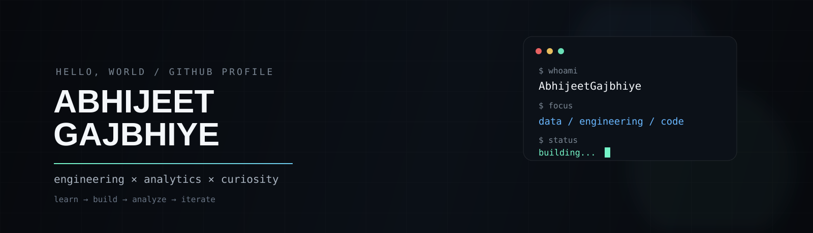

<div align="center">



<br>

<a href="https://github.com/AbhijeetGajbhiye">
  
</a>
<a href="https://github.com/AbhijeetGajbhiye?tab=repositories">
  
</a>


</div>

## about

I'm an engineering student who enjoys using **data, code, and structured problem-solving** to answer real questions.

I like projects where the interesting part isn't just writing code — it's figuring out **what the numbers actually mean**.

```text
01  clean the data
02  ask better questions
03  build the analysis
04  turn findings into decisions
```

## selected work

<table>
<tr>
<td width="50%">

### 📊 customer segmentation

**RFM analysis** on online retail orders.

→ 1,633 orders  
→ ~340 customers  
→ 6 customer segments  
→ 86.3% of revenue concentrated in Champions + At Risk

<a href="https://github.com/AbhijeetGajbhiye/customer-segmentation-rfm">view repository ↗</a>

</td>
<td width="50%">

### 🛒 retail sales analytics

A **SQL-first** analysis using a normalized 4-table retail database.

→ joins + CTEs  
→ window functions  
→ stockout risk  
→ cohort retention

<a href="https://github.com/AbhijeetGajbhiye/retail-sales-sql-analysis">view repository ↗</a>

</td>
</tr>

<tr>
<td width="50%">

### 💳 CredResolve forensics

A full analytics investigation of a collections dataset.

→ data-quality forensics  
→ normalized metrics  
→ independent Python + SQL pipelines  
→ executive dashboard + memo

<a href="https://github.com/AbhijeetGajbhiye/credresolve-analysis">view repository ↗</a>

</td>
<td width="50%">

### 🔭 what's next

More work around:

`Python` · `SQL` · `analytics` · `automation` · `AI`

and, hopefully, projects that are a little less boring than tutorials.

</td>
</tr>
</table>

## tools I actually use

<p>

</p>

## github activity

<p align="center">


</p>

<p align="center">

</p>

## currently

```text
▸ building     data + analytics projects
▸ learning     deeper Python and SQL
▸ improving    project documentation and engineering habits
▸ exploring    better ways to turn data into decisions
```

---

<div align="center">

`thanks for visiting`

<br><br>


</div>
