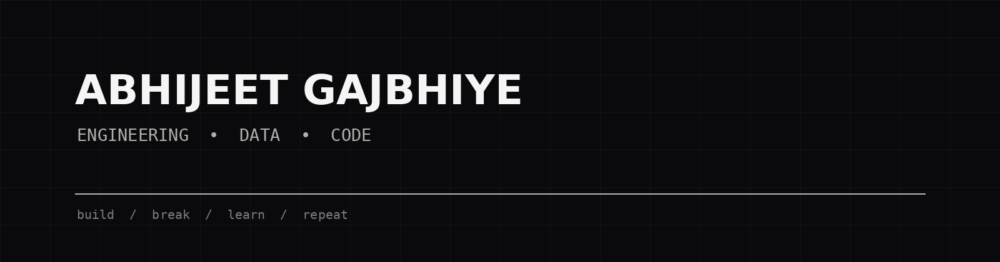

<div align="center">
  
</div>

<div align="center">

# ABHIJEET GAJBHIYE

### engineering • data • code

*building things, breaking things, learning why they broke.*

[](https://github.com/AbhijeetGajbhiye)

</div>

---

## `whoami`

I'm Abhijeet — an engineering student who enjoys turning messy problems into clean, useful solutions.

Right now, I'm especially interested in **Python, SQL, data analysis, and building projects that solve real problems.**

```text
> learn
> build
> break
> debug
> repeat
```

---

## `tech stack`

<p align="left">


</p>

---

## `featured work`

| Project | What it is |
| --- | --- |
| 📊 [Customer Segmentation — RFM Analysis](https://github.com/AbhijeetGajbhiye/customer-segmentation-rfm) | Customer segmentation using Recency, Frequency and Monetary analysis. |
| 🛒 [Retail Sales — SQL Analysis](https://github.com/AbhijeetGajbhiye/retail-sales-sql-analysis) | SQL-driven exploration of retail sales and business performance. |
| 💳 [CredResolve Analysis](https://github.com/AbhijeetGajbhiye/credresolve-analysis) | Data analysis and exploration built around the CredResolve dataset. |

---

## `github`

<p align="center">
  
  
</p>

<p align="center">
  
</p>

---

## `currently`

```text
↳ building      data & analysis projects
↳ learning      deeper Python + SQL
↳ improving     clean code, better READMEs, better projects
↳ exploring     what to build next
```

---

<div align="center">

### `thanks for stopping by`

*more projects coming soon.*

</div>
